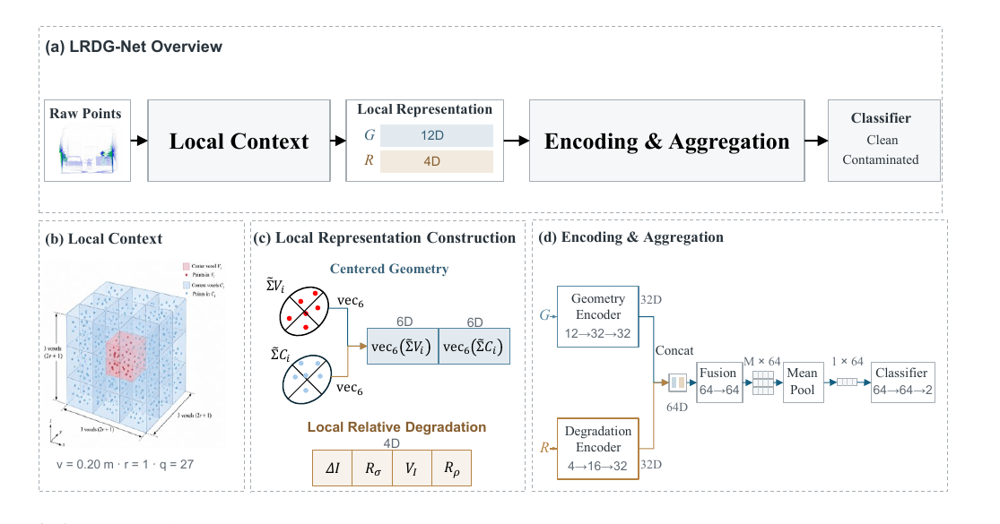

# LRDG-Net

**LiDAR cover contamination recognition using a local relative degradation representation**

This is the paper-aligned Python implementation of **LRDG-Net** for frame-level LiDAR-cover contamination recognition. It contains the main model, data preprocessing, training/evaluation workflows, comparison baselines, ablation studies, AT128 external-validation/calibration code, data-free tests, and reference result snapshots.

The raw **LIDAROC** dataset and the **Hesai AT128** recordings are not included.

## Method overview

<p align="center">
  
</p>

For every nonempty center voxel, LRDG-Net constructs two representations:

- **Centered geometry** `G ∈ R^12`: six independent entries of the normalized center-voxel covariance and six from the local context covariance.
- **Local relative degradation** `R ∈ R^4`:
  - `ΔI = μ̃_i - μ̃_Ci`
  - `Rσ = log((σ̃_i + ε)/(σ̃_Ci + ε))`, `ε = 1e-3`
  - `VI = σ̃_i`
  - `Rρ = log(1+n_i) - log(1+n_Ci/q)`, `q=(2r+1)^3`

The paper configuration uses `v = 0.20 m`, `r = 1`, and therefore `q = 27`.

The network is:

```text
Geometry branch:      12 -> 32 -> 32
Degradation branch:    4 -> 16 -> 32
Concatenation:                    64
Fusion:                  64 -> 64
Frame aggregation:      mean pooling
Classifier:              64 -> 64 -> 2
Dropout:                         0.2
Trainable parameters:         10,898
```

Absolute coordinates are used for voxelization/statistic construction, not as direct classifier inputs.

## Project structure

```text
LRDG-Net/
├── lrdg_net/                         # main Python package
│   ├── data/                         # descriptors, datasets, metadata, AT128 decoder
│   ├── models/                       # LRDG-Net model
│   ├── training/                     # training/checkpoint logic
│   ├── evaluation/                   # metrics and evaluation
│   ├── workflows/                    # end-to-end experiment workflows
│   └── cli.py                        # command-line interface
├── paper_experiments/
│   ├── baseline/                     # comparison methods
│   ├── ablation/                     # G / A / R / G+A / G+R
│   ├── component_ablation/           # R-component studies
│   └── sensitivity/                  # local-scale sensitivity
├── reference_results/                # paper-result snapshots; not used for training
├── docs/                             # experiment/protocol documentation
├── tests/                            # data-free regression tests
├── tools/                            # verification and analysis utilities
├── data/README.md                    # expected dataset layout
├── config.py                         # central experiment configuration
├── pyproject.toml                    # Python package metadata
├── requirements.txt                  # main dependencies
├── requirements-optional.txt         # optional baseline dependency
└── run_00_...run_22_*.py             # paper-oriented experiment entry points
```

## Python environment

Python **3.10 or newer** is supported.

Create and activate a virtual environment:

```bash
python -m venv .venv
```

Windows PowerShell:

```powershell
.venv\Scripts\Activate.ps1
```

Linux/macOS:

```bash
source .venv/bin/activate
```

Install the project:

```bash
python -m pip install --upgrade pip
pip install -e .
```

Alternatively, install dependencies first:

```bash
pip install -r requirements.txt
pip install -e . --no-deps
```

`torch-geometric` is only needed for the AutoGrAN baseline:

```bash
pip install -r requirements-optional.txt
```

> PyTorch wheels differ by operating system and CPU/CUDA environment. If you require a specific CUDA or CPU-only PyTorch build, install the appropriate PyTorch build first and then run `pip install -e . --no-deps` after installing the remaining dependencies.

## Data configuration

Default paths are project-relative and can be overridden with environment variables.

### LIDAROC

Default location:

```text
data/lidaroc/
```

or set:

```bash
LRDG_LIDAROC_ROOT=/path/to/lidaroc
```

Each input scan is expected to be a float32 `N×4` XYZI `.bin` file. Acquisition domains `5m`, `10m`, and `20m` are inferred from the path. Source train/validation splitting is performed at the acquisition-session level.

### Hesai AT128

Default locations:

```text
data/at128/pcap/
data/at128/AT128P_AngleCalibration.dat
```

or set:

```bash
LRDG_AT128_PCAP_ROOT=/path/to/at128_pcaps
LRDG_AT128_CALIBRATION=/path/to/AT128P_AngleCalibration.dat
```

Expected recording names are `<distance>m_<level>.pcap`, where `level=0` is clean and `level=1/2/3` are contaminated preparation conditions. See `data/README.md` for the detailed input contract.

### Output directory

By default, generated caches, checkpoints, and evaluations are written under:

```text
outputs/
```

Override it with:

```bash
LRDG_WORKSPACE_ROOT=/path/to/workspace
```

The computation device defaults to CUDA. To use CPU:

```bash
LRDG_DEVICE=cpu
```

## Paper training configuration

The main settings in `config.py` are:

| Setting | Value |
|---|---:|
| Optimizer | AdamW |
| Initial learning rate | `1e-3` |
| Weight decay | `1e-4` |
| Batch size | `8` |
| Maximum epochs | `60` |
| Early-stopping patience | `10` |
| Loss | Cross entropy |
| Voxel side length | `0.20 m` |
| Context radius | `1` |
| Seeds | `42, 2026, 3407` |

Target-domain data are not used for source-domain input normalization, early stopping, or checkpoint selection.

## Data-free verification

The following checks do not require the raw datasets:

```bash
python -m unittest discover -s tests -v
python run_00_smoke_test.py
python run_10_baseline_check.py
python run_14_ablation_check.py
python run_17_sensitivity_check.py
python run_19_component_ablation_check.py
python tools/verify_project.py
```

After editable installation, the same core checks are available through:

```bash
lrdg-net smoke
lrdg-net verify
```

or:

```bash
python -m lrdg_net smoke
python -m lrdg_net verify
```

## Main experiment entry points

| Experiment | Command(s) | Main output |
|---|---|---|
| LIDAROC preprocessing | `python run_01_preprocess_lidaroc.py` | feature cache |
| Six directed LIDAROC transfers | `python run_02_internal_cross_domain.py` | cross-domain metrics |
| Train all-LIDAROC source models | `python run_03_train_all_lidaroc.py` | source checkpoints |
| Prepare AT128 recordings | `python run_04_prepare_at128.py` | decoded/prepared AT128 data |
| Test configured model on AT128 | `python run_05_test_at128.py` | AT128 evaluation |
| Strict LIDAROC→AT128 test | `python run_06_all_lidaroc_to_at128.py` | external-validation metrics |
| Supplementary AT128 transfer | `python run_07_at128_transfer.py` | transfer-study metrics |
| Distance-wise AT128 transfer | `python run_08_at128_distance_transfer.py` | distance transfer metrics |
| Clean-reference calibration | `python run_09_at128_calibration.py` | calibrated sequence metrics |
| Baseline check / experiments | `run_10`–`run_13` | baseline results |
| Representation ablation | `run_14`–`run_16` | G/A/R/G+A/G+R results |
| Local-scale sensitivity | `run_17`–`run_18` | sensitivity results |
| R-component ablation | `run_19`–`run_22` | component results |

Detailed experiment definitions are under `docs/`.

## AT128 clean-reference calibration

For a frame, let the logit margin be

```text
m_t = z_t,contaminated - z_t,clean
```

For clean source-training frames, the source center and scale are estimated using the median and Gaussian-consistent MAD:

```text
c_S = median(m_t)
s_S = 1.4826 * median(|m_t - c_S|)
```

Source validation sequence scores are formed from normalized frame margins, and the source threshold `τ_S` is selected on source validation data.

At deployment, only known-clean target sequences are used to estimate target center/scale `c_T, s_T`; network parameters remain fixed. A target sequence is classified from the average normalized margin using:

```text
S(S) >= τ_S
```

The direct, uncalibrated AT128 result instead uses the mean raw frame margin with the fixed boundary:

```text
M(S) >= 0
```

## Reference results

The `reference_results/` directory stores read-only numerical snapshots from the supplied paper-aligned project. They are used only for traceability/tests and are not read by the training pipeline.

Main LIDAROC cross-acquisition result:

| Metric | LRDG-Net |
|---|---:|
| Mean Macro-F1 | **98.86%** |
| Worst-direction Macro-F1 | **96.49%** |
| Cross-direction standard deviation | **1.77 pp** |
| Mean FPR | **0.00%** |
| Trainable parameters | **10,898** |

AT128 sequence-level calibration:

| Scheme | Clean references | Mean Macro-F1 | Worst distance-wise mean Macro-F1 | FPR | FNR |
|---|---:|---:|---:|---:|---:|
| K0 direct | 0 | 42.86% | 42.86% | 100.00% | 0.00% |
| K1 | 1 | 99.15% | 92.06% | 1.50% | 0.00% |
| K3 | 3 | **99.99%** | **99.91%** | **0.012%** | 0.00% |

## Baselines and ablations

The project includes the evaluated implementations of Global-Statistics MLP, RangeNet-style, PointNet, PointNet++, DGCNN, PointNeXt-S-style, and AutoGrAN. `RangeNet-style` and `PointNeXt-S-style` are task-adapted implementations for this contamination-classification task rather than complete reproductions of the original training recipes.

Representation ablations implement `G`, `A`, `R`, `G+A`, and `G+R`. Component ablations implement the four single-component and four leave-one-component-out variants of `R`.

## Reproducibility notes

- Source train/validation splitting is performed by acquisition session to avoid frame leakage.
- Input normalization is fitted only from source-training samples.
- Each transfer direction is trained with seeds `42`, `2026`, and `3407`.
- The six seed-averaged transfer directions are equally weighted in the final cross-acquisition summary.
- Local-scale sensitivity uses seed `42` and is descriptive rather than target-test hyperparameter selection.
- AT128 calibration evaluation uses leave-one-distance-out testing and exhaustive K1/K3 clean-reference choices.
- Raw datasets are required for full end-to-end reproduction; the included tests are data-free consistency checks.

## Citation

Until a final bibliographic record/DOI is available, the manuscript can be cited as:

```bibtex
@unpublished{xiong_lrdgnet,
  title  = {LiDAR cover contamination recognition using a local relative degradation representation},
  author = {Xiong, Huapeng and Pei, Zhongwen and Zhang, Guanyu and Lu, Shaoan and Wu, Zhijun},
  note   = {Manuscript},
}
```

`CITATION.cff` is also included as machine-readable citation metadata.

## License status

The supplied manuscript/code package did not specify an open-source license. The included `LICENSE` file therefore records that no open-source reuse permission is being granted by this package itself. Replace it with the intended license only after the authors/institution determine the appropriate terms.

## Contact

Corresponding author: **Zhijun Wu** — `zjwu@tongji.edu.cn`
